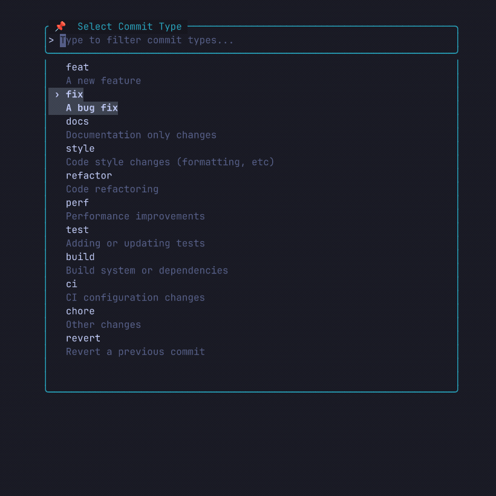

# Conventional Commits Plugin for Neovim

<a href="https://gitmoji.dev">
  
</a>
<a href="https://conventionalcommits.org">
  
</a>

A Neovim plugin for creating conventional commits with a clean, searchable UI.



*<sub>recorded with [asciinema](https://github.com/asciinema/asciinema), some emojis are looking weird - [here's a version](assets/demo_recorded.gif) with all emojis but lower quality</sub>*

## Features

- 🔍 Searchable commit types and emojis
- 👀 Preview before committing
- 📝 Full vim-style editing
- 🎯 No dependencies

## Installation

### Using [lazy.nvim](https://github.com/folke/lazy.nvim)

```lua
{
  'zerbiniandrea/conventional-commits.nvim',
  cmd = 'ConventionalCommit',
  config = function()
    require('conventional-commits').setup({
      -- Optional configuration here
    })
  end,
  keys = {
    { '<leader>gc', '<cmd>ConventionalCommit<cr>', desc = 'Conventional Commit' },
  },
}
```

### Using other plugin managers

The plugin follows standard Neovim plugin structure and *should* work with any plugin manager.

## Usage

```vim
:ConventionalCommit
```

Default keymap: `<leader>gc`

## Workflow

1. Select commit type
2. Enter scope (optional)
3. Select emoji (optional)
4. Enter commit message
5. Preview - `<CR>` to commit, `e` to edit, `b` to add body, `<Esc>` to cancel

## Configuration

```lua
require('conventional-commits').setup({
  show_emoji_step = true,  -- Show emoji selection step
  show_preview = true,     -- Show preview before committing
  border = 'rounded',      -- Border style ('rounded', 'single', 'double', 'solid')

  -- Customize commit types
  commit_types = {
    { key = 'feat', description = 'A new feature' },
    { key = 'fix', description = 'A bug fix' },
    { key = 'docs', description = 'Documentation changes' },
    { key = 'refactor', description = 'Code refactoring' },
    -- Add your own types...
  },

  -- Emojis are loaded from gitmojis.json
  -- Override if you want custom emojis:
  -- emojis = { { key = '✨', name = 'sparkles', description = 'new feature' } },
})
```

## Keybindings

**Selection menus:**
- Type to filter, `↓`/`↑` or `Ctrl-n`/`Ctrl-p` to navigate
- `<CR>` to select, `<Esc>` or `q` to cancel

**Input prompts:**
- Starts in insert mode, all vim commands work in normal mode
- `<CR>` to confirm, `<Esc>` or `q` to cancel

**Preview window:**
- `<CR>` to commit, `e` to edit, `b` to add/edit body
- `A` to stage all changes (`git add .`)
- `<Esc>` to cancel


